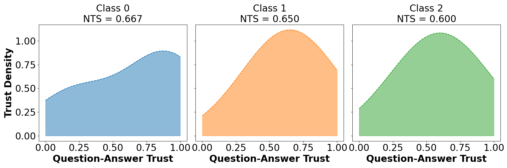

# TrustPy - Trustworthiness Python

Conda-Forge / PyPI package providing a Python implementation of trustworthiness quantification metrics for predictive models (e.g., DNNs):   

###
**The implementation is flexible and works out-the-box.**
###

## Installation
### Recommended 1: Install via Conda-Forge
The easiest way to install trustpy-tools is via Conda-Forge, which handles all dependencies automatically. Run the following command:
```bash
conda install -c conda-forge trustpy-tools
```

### Recommended 2: Install via PyPI (pip install)
If you prefer using pip (PyPI), you can install directly:
```bash
pip install trustpy-tools
```

### Alternative: Manual Installation
If you prefer to install the package manually or are not using Conda, you can install the required dependencies and clone the repository.

Install Dependencies
- **NumPy**: For numerical calculations.
- **Matplotlib**: For plotting the trust spectrum.
- **Scikit-learn**: For Kernel Density Estimation (KDE) in trust density estimation.

Install them via conda:

```bash
conda install numpy matplotlib scikit-learn
```

or


Install them via pip:

```bash
pip install numpy matplotlib scikit-learn
```

Clone the Repository
```bash
git clone https://github.com/yaniker/TrustPy.git
cd TrustPy
```

## Example Usage
```python
from trustpy import NTS, CNTS #This is how the package is imported.
import numpy as np

# Example oracle and predictions
oracle = np.array([0, 0, 1, 2, 2, 0, 1])  # True labels
predictions = np.array([
    [0.8, 0.1, 0.1],  # Correct, high confidence
    [1.0, 0.0, 0.0],  # Correct, high confidence
    [0.2, 0.7, 0.1],  # Correct, high confidence
    [0.1, 0.2, 0.7],  # Correct, high confidence
    [0.1, 0.4, 0.5],  # Correct, lower confidence
    [0.1, 0.8, 0.1],  # Incorrect, high confidence
    [0.3, 0.3, 0.4]   # Incorrect, low confidence
]
) #Replace this with your model's predictions (`predictions = model.predict()`)

# FOR NETTRUSTSCORE #
# Initialize with default parameters
nts = NTS(oracle, predictions) #This is how you initialize. trust_spectrum = True will save trust spectrum to the directory under "trust_spectrum.png"
nts_scores_dict = nts.compute() # Computes trustworthiness for each class and overall.
print(nts_scores_dict)

# FOR CONDITIONAL NETTRUSTSCORE #
# Initialize with default parameters
cnts = CNTS(oracle, predictions) #This is how you initialize. trust_spectrum = True will save trust spectrum to the directory under "trust_spectrum.png" and "conditional_trust_densities.png"
cnts_scores_dict = cnts.compute() # Computes trustworthiness for each class and overall.
print(cnts_scores_dict)
```

Example Plot for Trust Spectrum (`trust_spectrum = True`)


Example Plot for Conditional Trust Spectrum (`trust_spectrum = True`)


I shared the codes for the plots [Python scripts for plots](./assets/plots.py) for users to modify as needed.

## Licence
This project is licensed under the MIT License. See the  file for details.

## References for the methods so far:  
1.[How Much Can We Really Trust You? Towards Simple, Interpretable Trust Quantification Metrics for Deep Neural Networks](https://arxiv.org/pdf/2009.05835).  
2.[Where Does Trust Break Down? A Quantitative Trust Analysis of Deep Neural Networks via Trust Matrix and Conditional Trust Densities](https://arxiv.org/pdf/2009.14701).  

## If you use this package in your research, please cite the following papers accordingly:  

```
For NTS:
@article{wong2020much,
  title={How much can we really trust you? towards simple, interpretable trust quantification metrics for deep neural networks},
  author={Wong, Alexander and Wang, Xiao Yu and Hryniowski, Andrew},
  journal={arXiv preprint arXiv:2009.05835},
  year={2020}
}

For conditional NTS:
@article{hryniowski2020does,
  title={Where does trust break down? A quantitative trust analysis of deep neural networks via trust matrix and conditional trust densities},
  author={Hryniowski, Andrew and Wang, Xiao Yu and Wong, Alexander},
  journal={arXiv preprint arXiv:2009.14701},
  year={2020}
}

```
